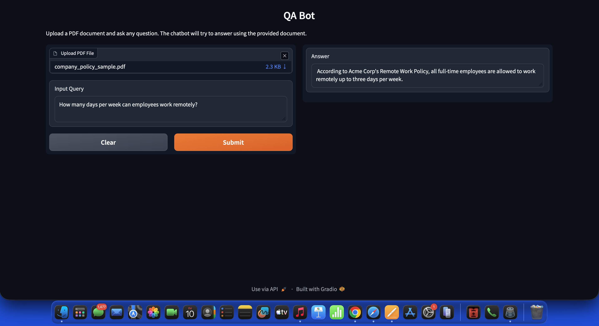

# 📄 SmartDoc QA Chatbot

An intelligent Question Answering (QA) chatbot built using **Python**, **LangChain**, **Gradio**, and **IBM Watsonx AI**. The application enables users to upload PDF documents and ask natural language questions, providing context-aware answers based on the document's content using Retrieval-Augmented Generation (RAG).

---

## 🚀 Features

- 📂 Upload PDF documents
- 🔍 Extract and process document text
- ✂️ Intelligent text chunking
- 🧠 Generate vector embeddings
- 📚 Store document embeddings in ChromaDB
- 💬 Ask questions in natural language
- 🤖 Context-aware responses using IBM Granite LLM
- 🌐 Interactive Gradio web interface

---

## 🛠️ Tech Stack

- Python
- LangChain
- IBM Watsonx AI
- ChromaDB
- PyPDF
- Gradio

---

## 📁 Project Structure

```
smartdoc-chatbot/
│
├── app.py
├── chatbot.py
├── loader.py
├── splitter.py
├── embeddings.py
├── vector_store.py
├── retriever.py
├── requirements.txt
├── README.md
│
└── screenshots/
    └── QA_bot.png
```

---

## ⚙️ How It Works

1. Upload a PDF document.
2. The application extracts text from the document.
3. The document is split into manageable chunks.
4. Each chunk is converted into vector embeddings.
5. The embeddings are stored in a Chroma vector database.
6. A retriever fetches the most relevant chunks for the user's query.
7. The LLM generates an accurate response based on the retrieved context.

---

## 📷 Demo

### QA Bot Interface



---

## ▶️ Installation

Clone the repository

```bash
git clone https://github.com/yourusername/smartdoc-chatbot.git
cd smartdoc-chatbot
```

Create a virtual environment

```bash
python -m venv venv
```

Activate the environment

**Windows**

```bash
venv\Scripts\activate
```

**macOS/Linux**

```bash
source venv/bin/activate
```

Install dependencies

```bash
pip install -r requirements.txt
```

Run the application

```bash
python app.py
```

The Gradio interface will open in your browser.

---

## 💡 Example

**Question**

> How many days per week can employees work remotely?

**Answer**

> According to Acme Corp's Remote Work Policy, all full-time employees are allowed to work remotely up to three days per week.

---

## 🎯 Future Improvements

- Support multiple PDF uploads
- Chat history
- Source citations
- Persistent vector database
- Docker deployment
- Authentication
- Cloud deployment using Hugging Face Spaces or Render

---

## 📄 License

This project is licensed under the MIT License.

---

## 👤 Author

Samridhi Bhardwaj
